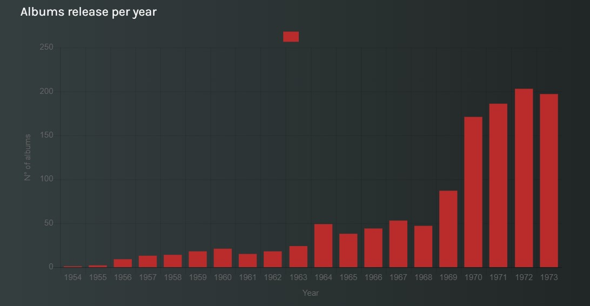

<!DOCTYPE html>
<html>
<head>
</head>
<body>

<h1 style="font-family:calibri; text-align:center;"> <i> Revolutionary Rhythms </i> </h1>

<h2 style="font-family:calibri;"> Article </h2>

 <i> “Rock and roll music, if you like it, if you feel it, you can't help but move to it. That's what happens to me. I can't help it.”
</i>

 <i> Elvis Presley </i> 

 

 Since its inception in the 1950s, rock and roll has had an important influence within the music industry, impacting both on the musical and cultural fields. Characterized by a combination of blues, country, R&B, the genre has evolved to embrace a variety of styles and subgenres in the contemporary landscape, ranging from punk rock to psychedelic rock and many others.
Rock music permeates our lives with its extensive influence on popular culture. In this article, we will provide an overview of the genre and its history, with a particular regard to the Italian music scene.

 
<h3 style="font-family:calibri;"> Origins of the rock genre </h3>
<table>&nbsp;<thead><tr><th>human</th><th>pic</th></tr></thead><tbody><tr><td><a class="table_result" href="http://www.wikidata.org/entity/Q303">Elvis Presley</a></td><td></td></tr><tr><td><a class="table_result" href="http://www.wikidata.org/entity/Q1203">John Lennon</a></td><td></td></tr><tr><td><a class="table_result" href="http://www.wikidata.org/entity/Q633">Neil Young</a></td><td></td></tr><tr><td><a class="table_result" href="http://www.wikidata.org/entity/Q392">Bob Dylan</a></td><td></td></tr><tr><td><a class="table_result" href="http://www.wikidata.org/entity/Q557">Patti Smith</a></td><td></td></tr></tbody></table>
 
 We retrieved albums releases according to a chronological order. By looking at the chart, we can infer that the first registered albums date back to the mid-1950s.
These are just some of the instances of pioneering rock and roll albums:
   
-	<i> Rock with Bill Haley and the Comets </i>, by Bill Haley & His Comets (1954);  
-	<i> Rock Around the Clock </i>, by Bill Haley & His Comets (1955);  
-	<i>Shake, Rattle and Roll </i>, by Bill Haley & His Comets (1955);  
-	<i> Elvis Presley </i>, by Elvis Presley (1956);  
-	<i> Rock, Rock, Rock </i>, by Chuck Berry (1956);  
-	<i> Elvis </i>, by Elvis Presley (1956).  
 

 As the genre acquired popularity, we can observe an exponential grow on the number of albums releases. If we consider the number of releases between 1950s and 1960s, we can notice how, in the span of a decade alone the amount of rock and roll albums published increased from 57 to 396. 

 

<h3 style="font-family:calibri;"> Rock 'n' roll in Italy </h3>

  
  
</body>
</html>
